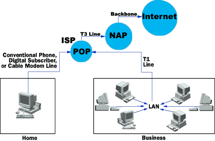

# How Internet Infrastructure Works

One of the greatest things about the Internet is that nobody really owns it. It is a global collection of networks, both big and small. These networks connect together in many different ways to form the single entity that we know as the Internet. In fact, the very name comes from this idea of interconnected networks.

Since its beginning in 1969, the Internet has grown from four host computer systems to tens of millions. However, just because nobody owns the Internet, it doesn't mean it is not monitored and maintained in different ways. The Internet Society, a non-profit group established in 1992, oversees the formation of the policies and protocols that define how we use and interact with the Internet.

In this article, you will learn about the basic underlying structure of the Internet. You will learn about domain name servers, network access points and backbones. But first you will learn about how your computer connects to others.

### The Internet: Computer Network Hierarchy

Every computer that is connected to the Internet is part of a network, even the one in your home. For example, you may use a modem and dial a local number to connect to an **Internet Service Provider (ISP)**. At work, you may be part of a **local area network (LAN)**, but you most likely still connect to the Internet using an ISP that your company has contracted with. When you connect to your ISP, you become part of their network. The ISP may then connect to a larger network and become part of their network. **The Internet is simply a network of networks**.

Most large communications companies have their own dedicated backbones connecting various regions. In each region, the company has a **Point of Presence (POP)**. The POP is a place for local users to access the company's network, often through a local phone number or dedicated line. The amazing thing here is that there is no overall controlling network. Instead, there are several high-level networks connecting to each other through **Network Access Points or NAPs**.

## Internet Network Example

Here's an example. Imagine that Company A is a large ISP. In each major city, Company A has a POP. The POP in each city is a rack full of modems that the ISP's customers dial into. Company A leases fiber optic lines from the phone company to connect the POPs together (see, for example, this [UUNET Data Center Connectivity Map](http://www.dyntex.com/our_network/uunet-map.html)).

Imagine that Company B is a corporate ISP. Company B builds large buildings in major cities and corporations locate their Internet server machines in these buildings. Company B is such a large company that it runs its own fiber optic lines between its buildings so that they are all interconnected.

In this arrangement, all of Company A's customers can talk to each other, and all of Company B's customers can talk to each other, but there is no way for Company A's customers and Company B's customers to intercommunicate. Therefore, Company A and Company B both agree to connect to NAPs in various cities, and traffic between the two companies flows between the networks at the NAPs.

In the real Internet, dozens of large Internet providers interconnect at NAPs in various cities, and trillions of bytes of data flow between the individual networks at these points. The Internet is a collection of huge corporate networks that agree to all intercommunicate with each other at the NAPs. In this way, every computer on the Internet connects to every other.

