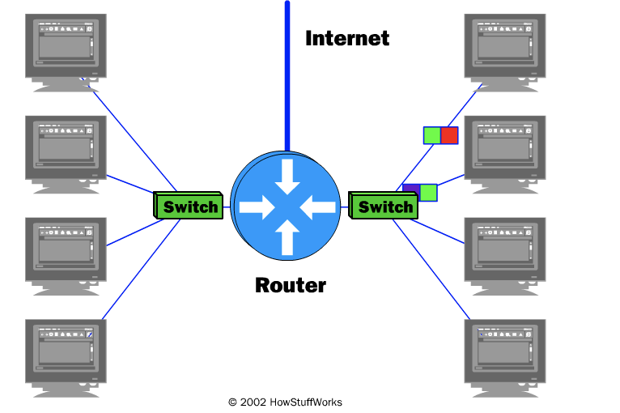

# How Internet Infrastructure Works

One of the greatest things about the Internet is that nobody really owns it. It is a global collection of networks, both big and small. These networks connect together in many different ways to form the single entity that we know as the Internet. In fact, the very name comes from this idea of interconnected networks.

Since its beginning in 1969, the Internet has grown from four host computer systems to tens of millions. However, just because nobody owns the Internet, it doesn't mean it is not monitored and maintained in different ways. The Internet Society, a non-profit group established in 1992, oversees the formation of the policies and protocols that define how we use and interact with the Internet.

In this article, you will learn about the basic underlying structure of the Internet. You will learn about domain name servers, network access points and backbones. But first you will learn about how your computer connects to others.

### The Internet: Computer Network Hierarchy

Every computer that is connected to the Internet is part of a network, even the one in your home. For example, you may use a modem and dial a local number to connect to an **Internet Service Provider (ISP)**. At work, you may be part of a **local area network (LAN)**, but you most likely still connect to the Internet using an ISP that your company has contracted with. When you connect to your ISP, you become part of their network. The ISP may then connect to a larger network and become part of their network. **The Internet is simply a network of networks**.

Most large communications companies have their own dedicated backbones connecting various regions. In each region, the company has a **Point of Presence (POP)**. The POP is a place for local users to access the company's network, often through a local phone number or dedicated line. The amazing thing here is that there is no overall controlling network. Instead, there are several high-level networks connecting to each other through **Network Access Points or NAPs**.

## Internet Network Example

Here's an example. Imagine that Company A is a large ISP. In each major city, Company A has a POP. The POP in each city is a rack full of modems that the ISP's customers dial into. Company A leases fiber optic lines from the phone company to connect the POPs together (see, for example, this [UUNET Data Center Connectivity Map](http://www.dyntex.com/our_network/uunet-map.html)).

Imagine that Company B is a corporate ISP. Company B builds large buildings in major cities and corporations locate their Internet server machines in these buildings. Company B is such a large company that it runs its own fiber optic lines between its buildings so that they are all interconnected.

In this arrangement, all of Company A's customers can talk to each other, and all of Company B's customers can talk to each other, but there is no way for Company A's customers and Company B's customers to intercommunicate. Therefore, Company A and Company B both agree to connect to NAPs in various cities, and traffic between the two companies flows between the networks at the NAPs.

In the real Internet, dozens of large Internet providers interconnect at NAPs in various cities, and trillions of bytes of data flow between the individual networks at these points. The Internet is a collection of huge corporate networks that agree to all intercommunicate with each other at the NAPs. In this way, every computer on the Internet connects to every other.

## The Function of an Internet Router

All of these networks rely on NAPs, backbones and **routers** to talk to each other. What is incredible about this process is that a message can leave one computer and travel halfway across the world through several different networks and arrive at another computer in a fraction of a second!

The routers determine where to send information from one computer to another. Routers are specialized computers that send your messages and those of every other Internet user speeding to their destinations along thousands of pathways. A router has two separate, but related, jobs:

- It ensures that information doesn't go where it's not needed. This is crucial for keeping large volumes of data from clogging the connections of "innocent bystanders."

- It makes sure that information does make it to the intended destination.

In performing these two jobs, a router is extremely useful in dealing with two separate computer networks. It joins the two networks, passing information from one to the other. It also protects the networks from one another, preventing the traffic on one from unnecessarily spilling over to the other. Regardless of how many networks are attached, the basic operation and function of the router remains the same. Since the Internet is one huge network made up of tens of thousands of smaller networks, its use of routers is an absolute necessity. For more information, read [How Routers Work](https://computer.howstuffworks.com/router.htm).

## Internet Backbone

The **National Science Foundation (NSF)** created the first high-speed backbone in 1987. Called **NSFNET**, it was a T1 line that connected 170 smaller networks together and operated at 1.544 Mbps (million bits per second). IBM, MCI and Merit worked with NSF to create the backbone and developed a T3 (45 Mbps) backbone the following year.

Backbones are typically fiber optic trunk lines. The trunk line has multiple fiber optic cables combined together to increase the capacity. Fiber optic cables are designated OC for optical carrier, such as OC-3, OC-12 or OC-48. An OC-3 line is capable of transmitting 155 Mbps while an OC-48 can transmit 2,488 Mbps (2.488 Gbps). Compare that to a typical 56K modem transmitting 56,000 bps and you see just how fast a modern backbone is.

Today there are many companies that operate their own high-capacity backbones, and all of them interconnect at various NAPs around the world. In this way, everyone on the Internet, no matter where they are and what company they use, is able to talk to everyone else on the planet. The entire Internet is a gigantic, sprawling agreement between companies to intercommunicate freely.

## Internet Protocol: IP Addresses

Every machine on the Internet has a unique identifying number, called an **IP Address**. The IP stands for **Internet Protocol**, which is the language that computers use to communicate over the Internet. A protocol is the pre-defined way that someone who wants to use a service talks with that service. The "someone" could be a person, but more often it is a computer program like a Web browser.

A typical IP address looks like this: 216.27.61.137.

To make it easier for us humans to remember, IP addresses are normally expressed in decimal format as a dotted decimal number like the one above. But computers communicate in binary form. Look at the same IP address in binary: 11011000.00011011.00111101.10001001.

The four numbers in an IP address are called octets, because they each have eight positions when viewed in binary form. If you add all the positions together, you get 32, which is why IP addresses are considered 32-bit numbers. Since each of the eight positions can have two different states (1 or zero), the total number of possible combinations per octet is 28 or 256. So each octet can contain any value between zero and 255. Combine the four octets and you get 232 or a possible 4,294,967,296 unique values!

Out of the almost 4.3 billion possible combinations, certain values are restricted from use as typical IP addresses. For example, the IP address 0.0.0.0 is reserved for the default network and the address 255.255.255.255 is used for [broadcasts](https://computer.howstuffworks.com/lan-switch.htm).

The octets serve a purpose other than simply separating the numbers. They are used to create **classes** of IP addresses that can be assigned to a particular business, government or other entity based on size and need. The octets are split into two sections: **Net and Host**. The Net section always contains the first octet. It is used to identify the network that a computer belongs to. Host (sometimes referred to as **Node**) identifies the actual computer on the network. The Host section always contains the last octet. There are five IP classes plus certain special addresses. You can learn more about IP classes at [What is an IP address?](https://computer.howstuffworks.com/internet/basics/question549.htm).

## Internet Protocol: Domain Name System

When the Internet was in its infancy, it consisted of a small number of computers hooked together with modems and telephone lines. You could only make connections by providing the IP address of the computer you wanted to establish a link with. For example, a typical IP address might be 216.27.22.162. This was fine when there were only a few hosts out there, but it became unwieldy as more and more systems came online.

The first solution to the problem was a simple text file maintained by the Network Information Center that mapped names to IP addresses. Soon this text file became so large it was too cumbersome to manage. In 1983, the University of Wisconsin created the **Domain Name System (DNS)**, which maps text names to IP addresses automatically. This way you only need to remember [www.howstuffworks.com](https://www.howstuffworks.com/), for example, instead of HowStuffWorks.com's IP address.

